# Requirements Specification

This document breaks down every requirement with detailed explanations and Mermaid diagrams.

---

## System Overview

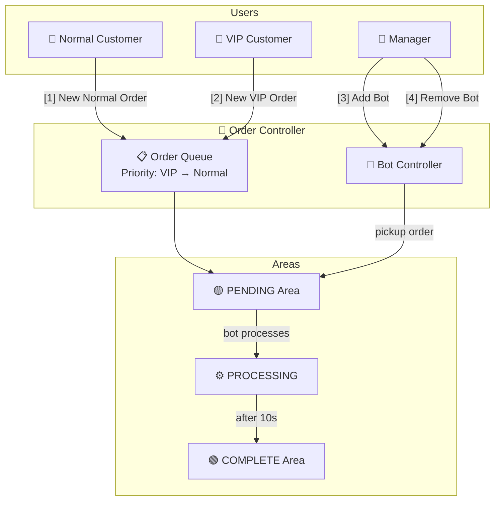

---

## R1: New Normal Order

> When "New Normal Order" clicked, a new order should show up in "PENDING" Area.

### Behavior

- User presses `[1]`
- System creates an order with auto-incremented ID
- Order type = `NORMAL`
- Order status = `PENDING`
- Order is appended to the **end** of the pending queue
- If any bot is `IDLE`, it immediately picks up this order

### Flow

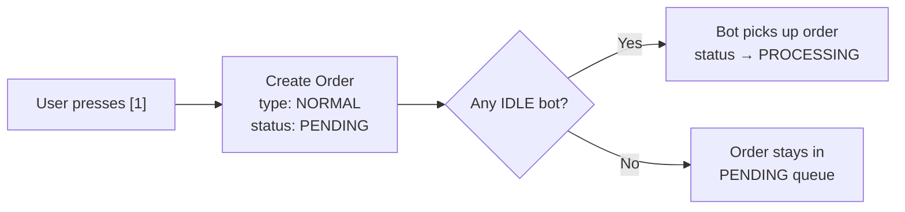

### Queue Position Example

```
Before:  [VIP#2] → [Normal#1]
Action:  New Normal Order #3
After:   [VIP#2] → [Normal#1] → [Normal#3]
                                  ↑ appended at end
```

---

## R2: New VIP Order (Priority Queue)

> When "New VIP Order" clicked, a new order should show up in "PENDING" Area. It should place in-front of all existing "Normal" order but behind of all existing "VIP" order.

### Behavior

- User presses `[2]`
- System creates an order with auto-incremented ID
- Order type = `VIP`
- Order status = `PENDING`
- Order is inserted **after the last VIP order** but **before the first Normal order**
- If any bot is `IDLE`, it immediately picks up the highest-priority pending order

### Flow

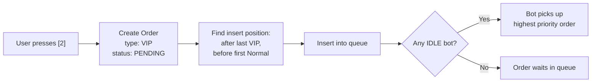

### Priority Insertion Logic

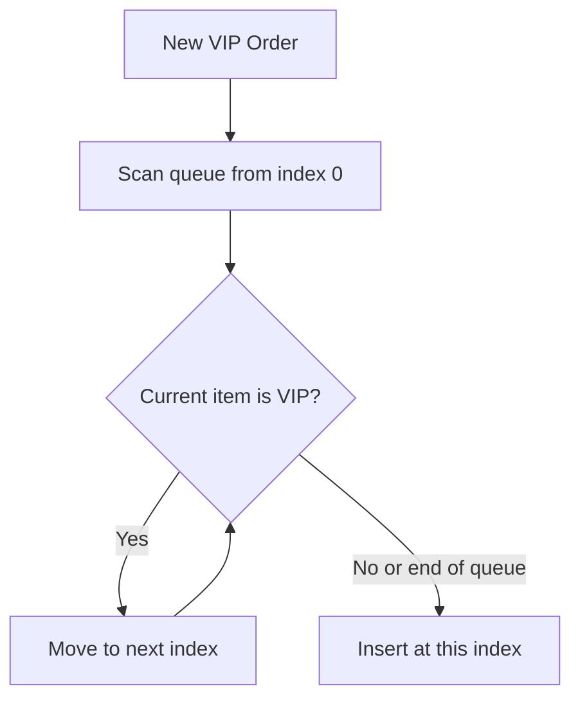

### Queue Position Examples

```
Example 1 — Insert among existing VIPs:
  Before:  [VIP#1] → [Normal#2] → [Normal#3]
  Action:  New VIP Order #4
  After:   [VIP#1] → [VIP#4] → [Normal#2] → [Normal#3]
                      ↑ after last VIP, before first Normal

Example 2 — No existing VIPs:
  Before:  [Normal#1] → [Normal#2]
  Action:  New VIP Order #3
  After:   [VIP#3] → [Normal#1] → [Normal#2]
            ↑ inserted at front

Example 3 — Multiple VIPs exist:
  Before:  [VIP#1] → [VIP#3] → [Normal#2] → [Normal#4]
  Action:  New VIP Order #5
  After:   [VIP#1] → [VIP#3] → [VIP#5] → [Normal#2] → [Normal#4]
                                 ↑ after all existing VIPs

Example 4 — Empty queue:
  Before:  (empty)
  Action:  New VIP Order #1
  After:   [VIP#1]
```

---

## R3: Unique & Increasing Order Numbers

> The order number should be unique and increasing.

### Behavior

- Order IDs start at `1`
- Each new order (VIP or Normal) gets the next sequential number
- IDs never repeat, even if orders are completed or returned to queue
- The counter never resets during a session

### Flow

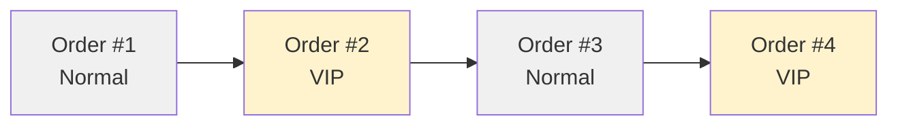

### Rules

```
✓ Order #1 (Normal), #2 (VIP), #3 (Normal) — correct, always increasing
✗ Order #1 (Normal), #1 (VIP)              — wrong, duplicate ID
✗ Order #3 (Normal), #2 (VIP)              — wrong, not increasing
```

---

## R4: Bot Processing (10 seconds)

> When "+ Bot" clicked, a bot should be created and start processing the order inside "PENDING" area. After 10 seconds picking up the order, the order should move to "COMPLETE" area. Then the bot should start processing another order if there is any left in "PENDING" area.

### Behavior

- User presses `[3]`
- New bot is created with auto-incremented ID
- Bot immediately checks the pending queue
- If orders exist: bot picks up the **first order** (highest priority) and starts processing
- Processing takes exactly **10 seconds** (`setTimeout`)
- After 10 seconds: order status → `COMPLETE`, moved to complete area
- Bot then checks the queue again for the next order
- Bot can only process **1 order at a time**

### Flow

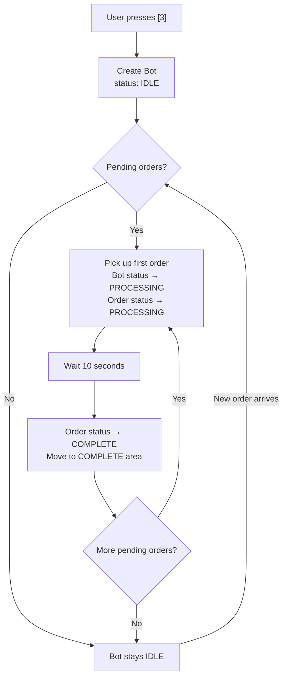

### Bot Processing Lifecycle

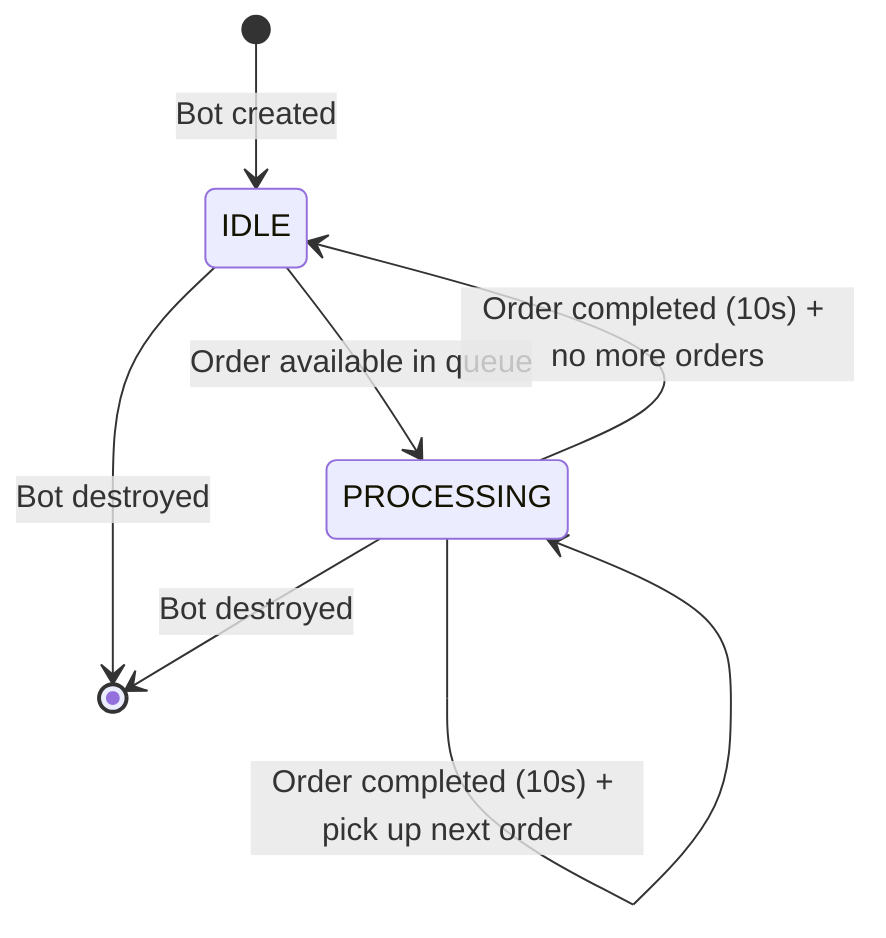

### Multiple Bots — Parallel Processing

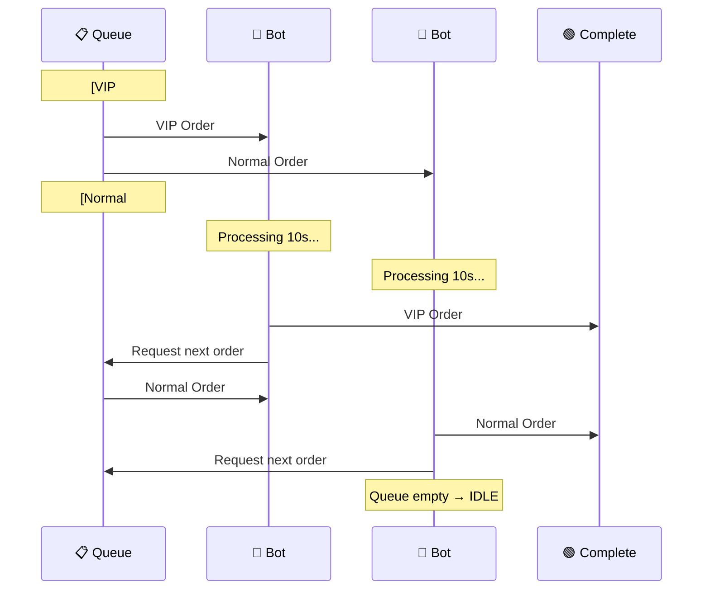

---

## R5: Bot IDLE State

> If there is no more order in the "PENDING" area, the bot should become IDLE until a new order comes in.

### Behavior

- After a bot completes an order, it checks the pending queue
- If queue is empty: bot status → `IDLE`
- Bot remains `IDLE` until a new order is added to the queue
- When a new order arrives, the system checks for idle bots and assigns the order

### Flow

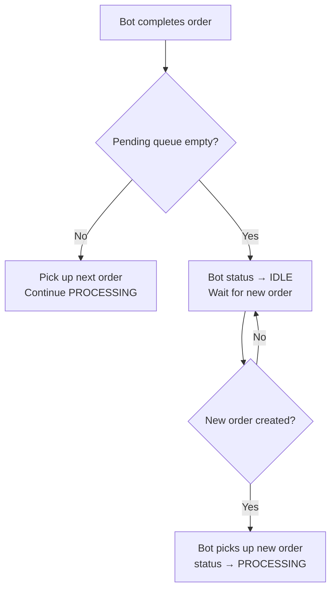

### Idle Bot Resume — Trigger Points

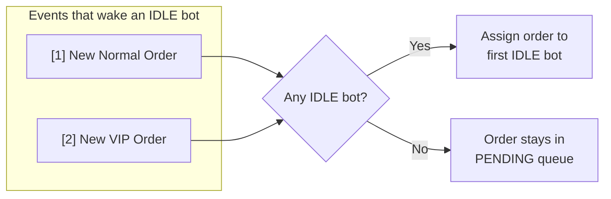

---

## R6: Bot Removal

> When "- Bot" clicked, the newest bot should be destroyed. If the bot is processing an order, it should also stop the process. The order should return to its original position in the "PENDING" area (maintaining VIP/Normal order priority).

### Behavior

- User presses `[4]`
- The **newest bot** (highest ID / last added) is removed
- If the bot was `IDLE`: simply destroy it
- If the bot was `PROCESSING`: 
  - Stop the 10s timer (`clearTimeout`)
  - Return the order to `PENDING` status
  - Re-insert the order into the queue at the correct priority position
- If no bots exist: show error message

### Flow

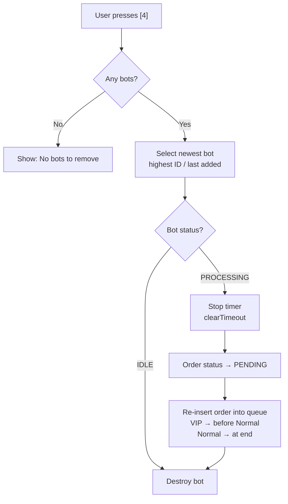

### Order Return — Priority Re-insertion

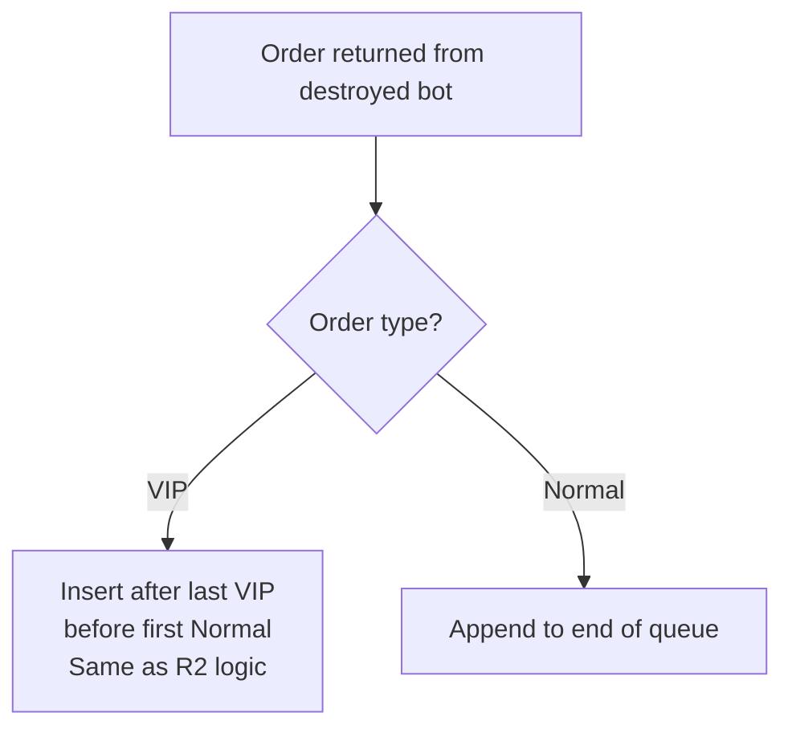

### Example — Bot Removed While Processing

```
State before removal:
  Bot #1: PROCESSING Normal Order #1
  Bot #2: PROCESSING VIP Order #4
  Queue:  [Normal#3, Normal#5]

Action: Remove Bot (removes #2, the newest)

  Bot #2 destroyed
  VIP Order #4 returned to PENDING
  Queue after: [VIP#4, Normal#3, Normal#5]
               ↑ VIP re-inserted before all Normal orders

  Bot #1 continues processing Normal Order #1 (unaffected)
```

### Example — Multiple Removals

```
State:
  Bot #1: PROCESSING Normal Order #1
  Bot #2: IDLE
  Bot #3: PROCESSING VIP Order #5
  Queue:  [Normal#3]

Remove Bot → removes #3 (newest)
  VIP Order #5 → returned to queue
  Queue: [VIP#5, Normal#3]

Remove Bot → removes #2 (now newest)
  Bot #2 was IDLE, no order to return
  Queue: [VIP#5, Normal#3] (unchanged)

Remove Bot → removes #1 (last remaining)
  Normal Order #1 → returned to queue
  Queue: [VIP#5, Normal#1, Normal#3]
         ↑ VIP still first, Normal #1 re-inserted at end
```

---

## R7: No Data Persistence

> No data persistence is needed for this prototype, you may perform all the process inside memory.

### Behavior

- All state is stored in JavaScript class instances (arrays, objects)
- No files, databases, or external storage
- State resets when the application restarts
- The only file output is `result.txt` (generated by the scripted simulation)

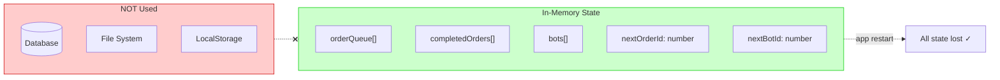

---

## Complete Order Lifecycle

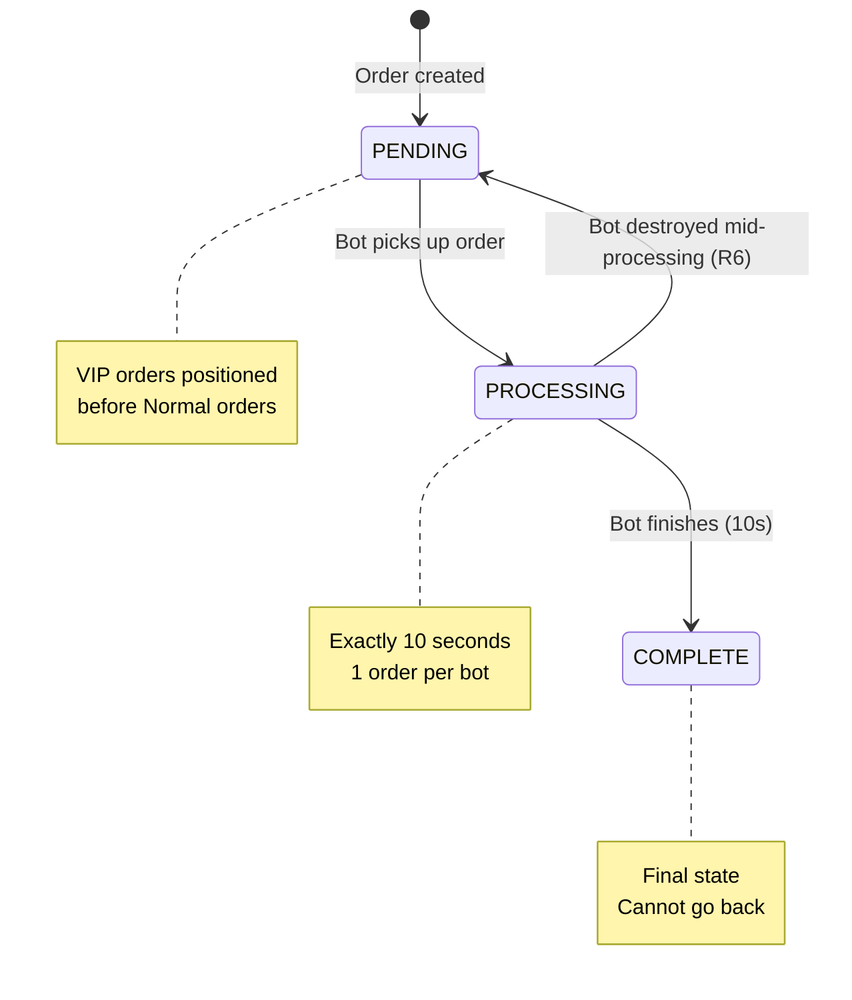

---

## Complete System Flow

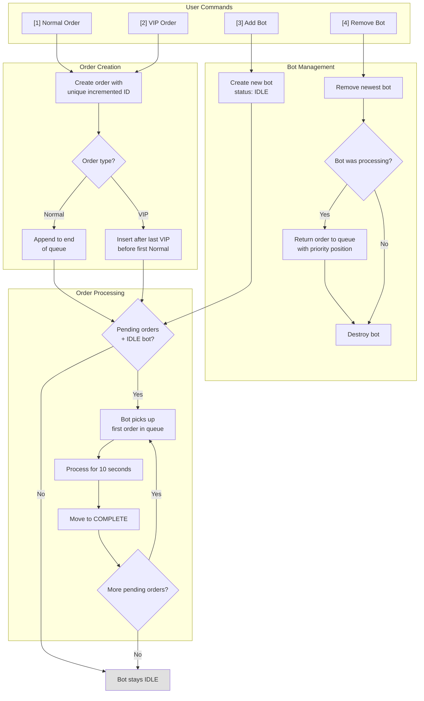

---

## Data Model

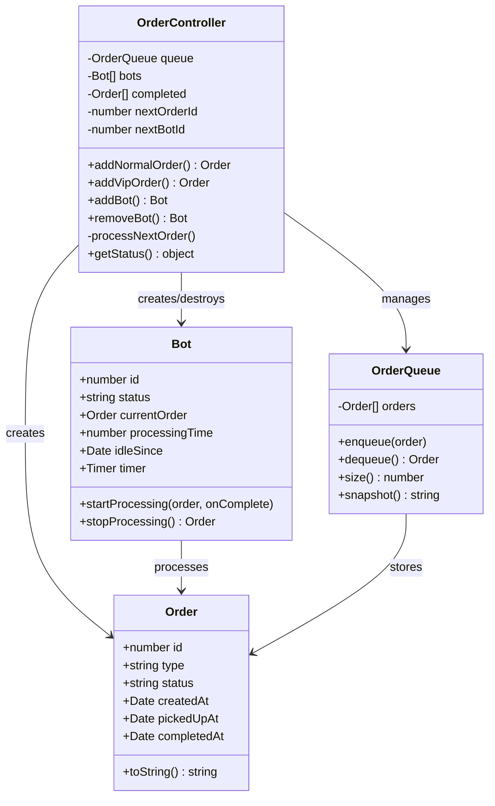

---

## Requirement Traceability Matrix

| Req | User Story | Test Scenario | CLI Command | Verification |
|-----|-----------|---------------|-------------|-------------|
| R1 | Normal customer → PENDING | Create normal order, verify in queue | `[1]` | Order appears at end of pending queue |
| R2 | VIP member → before Normal | Create VIP after Normal orders, check position | `[2]` | VIP inserted before all Normal, after existing VIP |
| R3 | Unique increasing numbers | Create multiple orders, check IDs | `[1]`, `[2]` | IDs are sequential: 1, 2, 3, 4... |
| R4 | Bot processes in 10s | Add bot with pending orders, wait | `[3]` | Order moves to COMPLETE after 10s |
| R5 | Bot goes IDLE | Bot finishes with empty queue | automatic | Bot status shows IDLE, resumes on new order |
| R6 | Remove newest bot | Remove bot mid-processing | `[4]` | Newest bot removed, order returns to correct queue position |
| R7 | No persistence | Restart app | automatic | All state resets, no files/DB used |
