# Technical Documentation

McDonald's Order Management System — Backend CLI Application

---

## Table of Contents

1. [Overview](#1-overview)
2. [Tech Stack](#2-tech-stack)
3. [Project Structure](#3-project-structure)
4. [Architecture](#4-architecture)
5. [Module Reference](#5-module-reference)
6. [Data Flow](#6-data-flow)
7. [How to Build & Run](#7-how-to-build--run)
8. [Testing](#8-testing)
9. [CI/CD Pipeline](#9-cicd-pipeline)
10. [Design Decisions](#10-design-decisions)
11. [Related Documentation](#11-related-documentation)

---

## 1. Overview

A Node.js CLI application that simulates McDonald's automated order management with cooking bots. The system handles a priority queue (VIP orders before Normal), manages bot lifecycles (create, process, destroy), and enforces a 10-second processing time per order — all in memory with no external dependencies.

The application has two modes:

| Mode | Entry Point | Purpose |
|------|-------------|---------|
| **Scripted** | `index.js` | Automated simulation → outputs to `result.txt` for CI |
| **Interactive** | `interactive.js` | Live CLI with real-time dashboard for interview demo |

---

## 2. Tech Stack

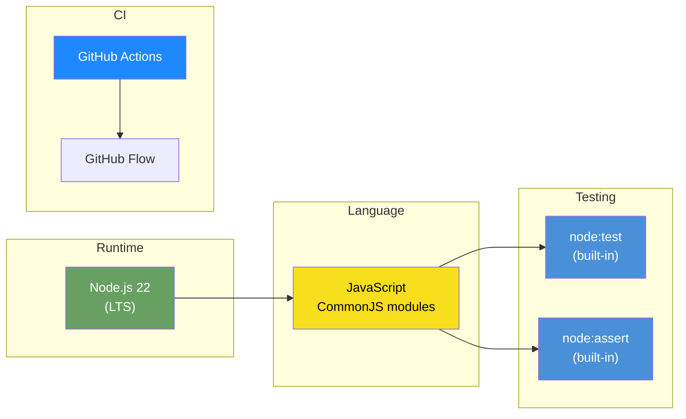

| Component | Choice | Why |
|-----------|--------|-----|
| Runtime | Node.js 22.19.0 | Matches CI environment exactly |
| Language | Plain JavaScript | No build step, no TypeScript overhead |
| Module System | CommonJS (`require` / `module.exports`) | Simpler config, no `"type": "module"` needed |
| Test Framework | `node:test` + `node:assert` | Built into Node.js, zero install |
| Dependencies | **None** | Zero `npm install`, no `node_modules`, no supply chain risk |
| CI | GitHub Actions | Provided by the assignment |
| Git Workflow | GitHub Flow | Single branch → PR → merge |

---

## 3. Project Structure

```
se-take-home-assignment/
│
├── AGENTS.md                # Project knowledge for all LLM agents
├── CLAUDE.md                # Claude Code instructions → AGENTS.md
├── index.js                 # Entry: scripted simulation → result.txt
├── interactive.js           # Entry: interactive CLI for interview
├── package.json             # Project metadata, npm scripts (zero deps)
│
├── src/                     # Core business logic
│   ├── order.js             # Order data model
│   ├── bot.js               # Bot data model + processing logic
│   ├── order-queue.js       # Priority queue (VIP before Normal)
│   ├── order-controller.js  # Orchestrator — ties everything together
│   ├── logger.js            # Formatted output (shared by both modes)
│   └── timestamp.js         # Date/time formatting utility
│
├── tests/                   # All test files
│   ├── test.js              # Unit tests (node:test)
│   └── scenario-test.js     # Requirement-based scenarios (R1-R7)
│
├── scripts/                 # CI shell scripts
│   ├── build.sh             # Build step (verifies Node.js exists)
│   ├── test.sh              # Runs unit tests
│   ├── run.sh               # Runs simulation → writes result.txt
│   └── result.txt           # Generated simulation output
│
├── docs/                    # Design & specification documents
│   ├── TECHNICAL.md         # This file
│   ├── REQUIREMENTS.md      # Requirements breakdown with Mermaid diagrams
│   ├── CLI-DESIGN.md        # CLI visual specification
│   ├── PROPOSAL.md          # Implementation proposal
│   └── WORKFLOW.md          # Agent dispatch workflow
│
├── agent-review/            # Agent test/review logs (proof of work)
│
├── .github/
│   └── workflows/
│       └── backend-verify-result.yaml   # CI workflow
│
├── README.md                # Assignment instructions
└── LICENSE
```

### File Roles Diagram

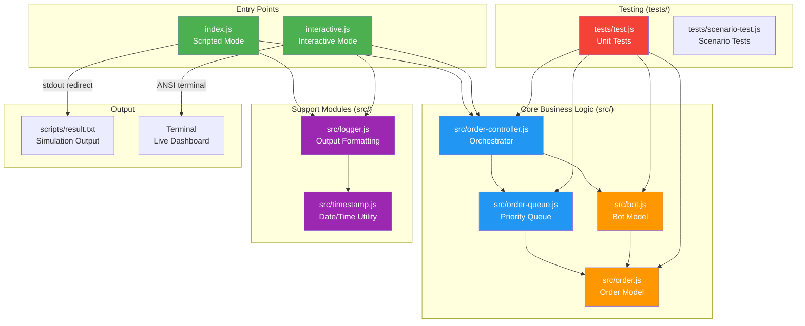

### File Size Guide

Each module is intentionally small — a single responsibility that fits on one screen:

| File | Estimated Lines | Responsibility |
|------|----------------|----------------|
| `order.js` | ~25 | Order class with timestamps |
| `bot.js` | ~50 | Bot class with injectable timer |
| `order-queue.js` | ~45 | Priority queue with VIP/Normal insertion |
| `order-controller.js` | ~120 | Orchestration, event-driven assignment |
| `logger.js` | ~150 | All output formatting, tables, status board |
| `timestamp.js` | ~10 | `YYYY-MM-DD HH:MM:SS` and `HH:MM:SS` formatters |
| `index.js` | ~80 | Scripted simulation scenario |
| `interactive.js` | ~100 | Raw mode stdin, ANSI rendering, live clock |
| `test.js` | ~200 | All unit tests |

---

## 4. Architecture

### Layer Diagram

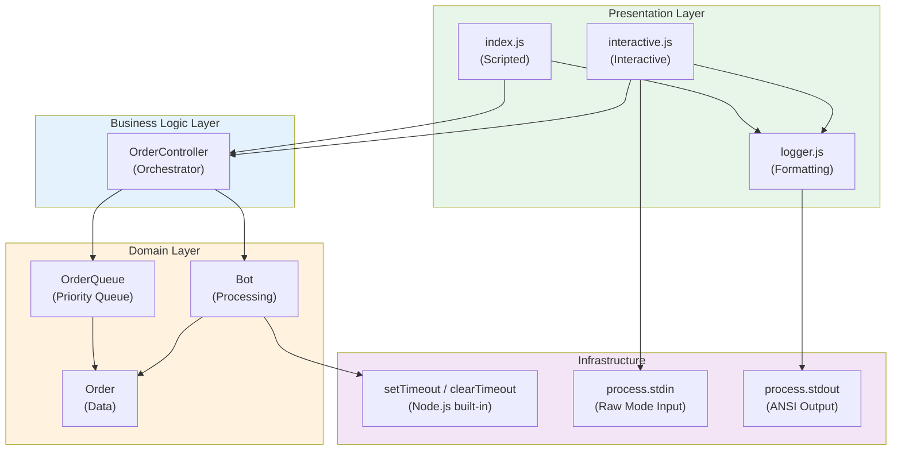

### Component Interaction

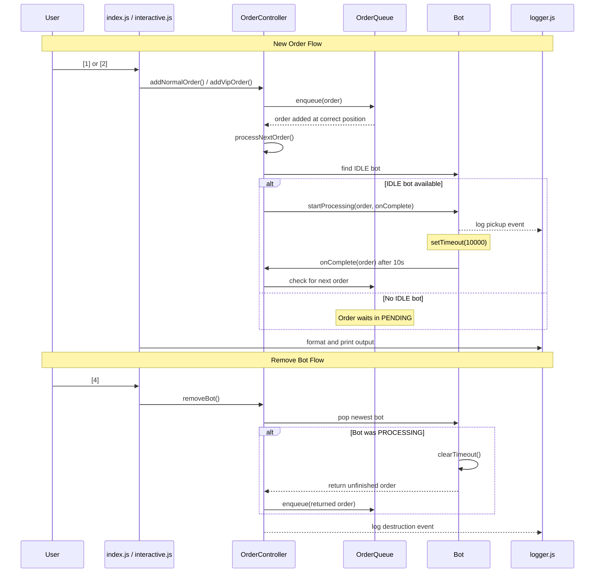

### Event-Driven Design

The system uses two trigger points that both call the same `processNextOrder()` method:

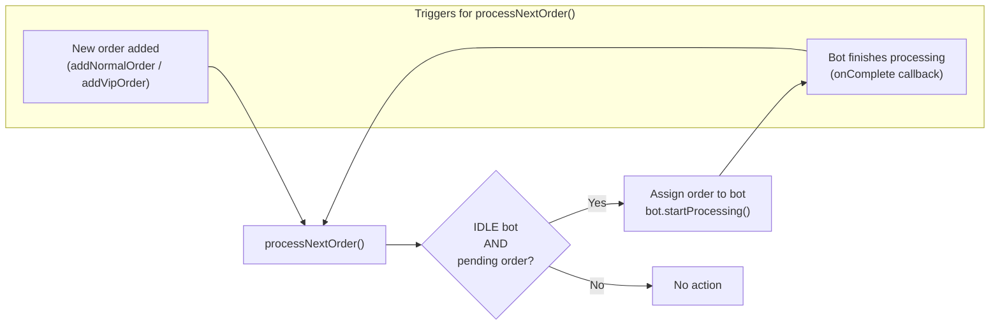

No polling. No arbitrary delays. No `setInterval` checking for work. The system reacts only when state changes.

---

## 5. Module Reference

### order.js

```
Class: Order
├── Constructor(id, type)
│   ├── id: number              Auto-incremented by controller
│   ├── type: 'NORMAL' | 'VIP'  Set at creation, never changes
│   ├── status: 'PENDING'       Initial state
│   ├── createdAt: Date         When order was placed
│   ├── pickedUpAt: null        Set when bot starts processing
│   └── completedAt: null       Set when bot finishes
│
├── Methods
│   └── toString()              "Normal Order #1" or "⭐ VIP Order #2"
│
└── Exports: { Order }
```

### bot.js

```
Class: Bot
├── Constructor(id, processingTime = 10000)
│   ├── id: number              Auto-incremented by controller
│   ├── status: 'IDLE'          Initial state
│   ├── currentOrder: null      The order being processed
│   ├── processingTime: number  Milliseconds (injectable for tests)
│   ├── idleSince: Date         When bot became idle
│   └── timer: null             setTimeout reference
│
├── Methods
│   ├── startProcessing(order, onComplete)
│   │   ├── Sets status → 'PROCESSING'
│   │   ├── Sets order.status → 'PROCESSING'
│   │   ├── Sets order.pickedUpAt → now
│   │   ├── Starts setTimeout(processingTime)
│   │   └── Calls onComplete(order) when timer fires
│   │
│   └── stopProcessing()
│       ├── Calls clearTimeout(timer)
│       ├── Sets order.status → 'PENDING'
│       ├── Sets status → 'IDLE'
│       └── Returns the unfinished order (or null)
│
└── Exports: { Bot }
```

### order-queue.js

```
Class: OrderQueue
├── Constructor()
│   └── orders: []              Internal array
│
├── Methods
│   ├── enqueue(order)
│   │   ├── VIP: insert after last VIP, before first Normal
│   │   └── Normal: append to end
│   │
│   ├── dequeue()
│   │   └── Returns and removes first order (index 0)
│   │
│   ├── size()
│   │   └── Returns orders.length
│   │
│   ├── isEmpty()
│   │   └── Returns orders.length === 0
│   │
│   ├── snapshot()
│   │   └── Returns "⭐#2 → #1 → #3" format string
│   │
│   └── toArray()
│       └── Returns shallow copy of orders array
│
└── Exports: { OrderQueue }
```

**Priority insertion algorithm:**

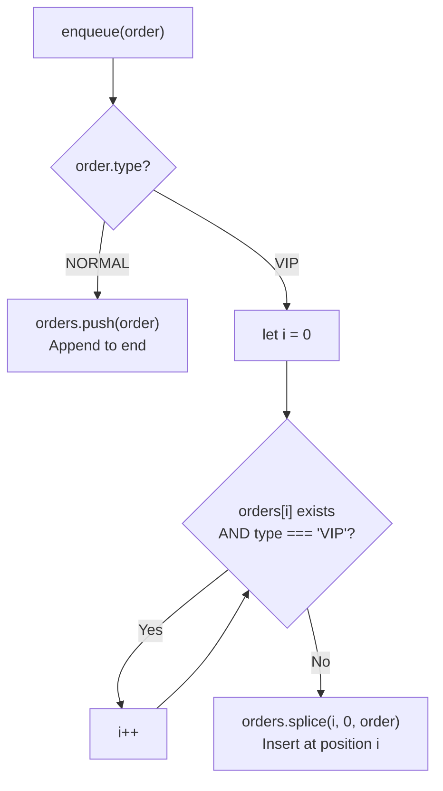

### order-controller.js

```
Class: OrderController
├── Constructor(processingTime = 10000)
│   ├── queue: OrderQueue       Pending orders
│   ├── bots: []                Active bots
│   ├── completed: []           Completed orders
│   ├── nextOrderId: 1          Auto-increment counter
│   ├── nextBotId: 1            Auto-increment counter
│   └── processingTime: number  Passed to new Bot instances
│
├── Methods
│   ├── addNormalOrder()
│   │   ├── Creates Order(id, 'NORMAL')
│   │   ├── queue.enqueue(order)
│   │   ├── Calls processNextOrder()
│   │   └── Returns order
│   │
│   ├── addVipOrder()
│   │   ├── Creates Order(id, 'VIP')
│   │   ├── queue.enqueue(order)  (priority insert)
│   │   ├── Calls processNextOrder()
│   │   └── Returns order
│   │
│   ├── addBot()
│   │   ├── Creates Bot(id, processingTime)
│   │   ├── bots.push(bot)
│   │   ├── Calls processNextOrder()
│   │   └── Returns bot
│   │
│   ├── removeBot()
│   │   ├── Pops last bot from bots[] (newest)
│   │   ├── Calls bot.stopProcessing()
│   │   ├── If returned order: queue.enqueue(order)
│   │   └── Returns removed bot (or null if no bots)
│   │
│   ├── processNextOrder() [private]
│   │   ├── Finds IDLE bots
│   │   ├── For each: if queue not empty, assign order
│   │   └── bot.startProcessing(order, onComplete)
│   │
│   └── getStatus()
│       └── Returns { bots, pending, completed, summary }
│
└── Exports: { OrderController }
```

### logger.js

```
Module: logger
├── Event Log Functions
│   ├── logTimestamp()                    "[YYYY-MM-DD HH:MM:SS]"
│   ├── logOrderCreated(order)           "✓ Normal Order #1 created"
│   ├── logBotCreated(bot)               "✓ Bot #1 created"
│   ├── logBotPickup(bot, order, wait)   "🤖 Bot #1 → picked up ⭐ VIP Order #2 (waited 2s)"
│   ├── logBotCompleted(bot, order, t)   "✓ Bot #1 completed ⭐ VIP Order #2 (10s)"
│   ├── logBotIdle(bot)                  "🤖 Bot #1 idle — no pending orders"
│   ├── logBotDestroyed(bot, reason)     "✗ Bot #2 destroyed (was idle)"
│   ├── logOrderReturned(order, wait)    "↩ ⭐ VIP Order #4 returned to PENDING (waited 5s)"
│   └── logQueueSnapshot(orders)         "📋 Queue: ⭐#2 → #1 → #3"
│
├── Rendering Functions (Interactive Mode)
│   ├── renderMenu(clock)                Main menu with live clock
│   ├── renderStatusBoard(state)         Full status board with tables
│   └── renderSummary(state)             Final summary box
│
├── Table Helpers
│   ├── renderBotsTable(bots)            Bot details with progress bars
│   ├── renderPendingTable(orders)       Pending queue with wait times
│   ├── renderCompleteTable(orders)      Completed with timestamps
│   └── renderProgressBar(elapsed, total) "████████░░░░ 60%"
│
└── Exports: { all above functions }
```

### timestamp.js

```
Module: timestamp
├── getTimestamp()        Returns "YYYY-MM-DD HH:MM:SS"
├── getTimeOnly()        Returns "HH:MM:SS"
└── getDateOnly()        Returns "YYYY-MM-DD"

Exports: { getTimestamp, getTimeOnly, getDateOnly }
```

### index.js (Scripted Mode)

```
Flow:
1. Create OrderController
2. Print header box
3. Execute simulation steps with delays
4. Print section headers between phases
5. Await all processing completion
6. Print final summary box
7. Process exits cleanly (no orphaned timers)

Output: stdout → piped to scripts/result.txt by run.sh
```

### interactive.js (Interactive Mode)

```
Flow:
1. Enable raw mode (process.stdin.setRawMode(true))
2. Render main menu with live clock
3. Listen for keypress events
4. On valid key: execute command, print event log
5. On [5]: switch to status board view (live refresh)
6. On [0]: clean up timers, exit
7. Bot completions print inline regardless of current view

Input:  Single keypress, no Enter needed
Output: ANSI terminal with cursor control
```

---

## 6. Data Flow

### Order Lifecycle

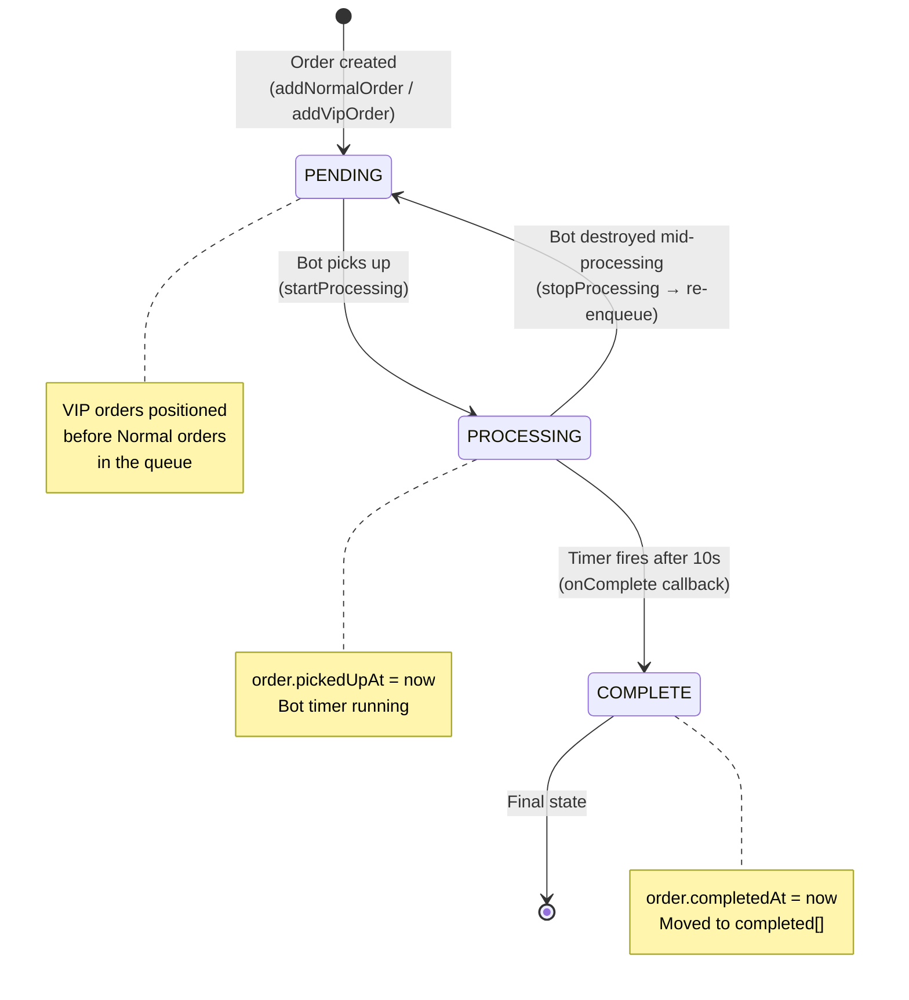

### Bot Lifecycle

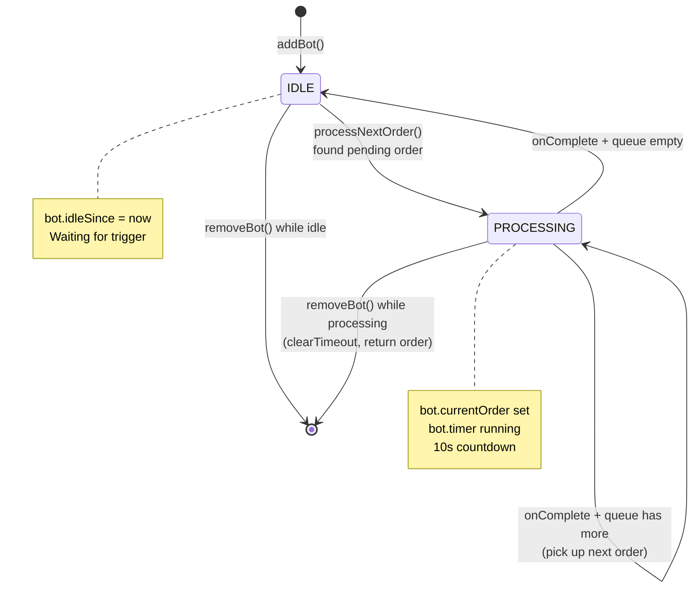

### Priority Queue — Visual Walkthrough

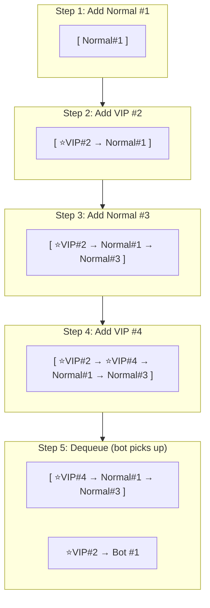

### Full Simulation Timeline

```mermaid
gantt
    title Scripted Simulation Timeline
    dateFormat ss
    axisFormat %Ss

    section Orders
    Create Normal #1        :o1, 00, 1s
    Create VIP #2           :o2, 00, 1s
    Create Normal #3        :o3, 00, 1s
    Create VIP #4           :o4, 11, 1s

    section Bot #1
    Created                 :b1c, 01, 1s
    Processing VIP #2       :b1p1, 01, 10s
    Processing Normal #3    :b1p2, 11, 10s
    Idle                    :b1i, 21, 3s

    section Bot #2
    Created                 :b2c, 01, 1s
    Processing Normal #1    :b2p1, 01, 10s
    Idle                    :b2i1, 11, 1s
    Processing VIP #4       :b2p2, 12, 10s
    Destroyed               :b2d, 22, 1s

    section Queue State
    VIP#2, N#1, N#3         :qs1, 00, 1s
    N#3                     :qs2, 01, 10s
    Empty                   :qs3, 11, 1s
    Empty                   :qs4, 12, 10s
```

---

## 7. How to Build & Run

### Prerequisites

| Requirement | Version | Check |
|-------------|---------|-------|
| Node.js | 22.x | `node --version` |
| npm | 10.x | `npm --version` |
| Git | any | `git --version` |

### Quick Start

```bash
# Clone the repository
git clone <your-fork-url>
cd se-take-home-assignment

# Build (verifies Node.js is installed)
./scripts/build.sh

# Run tests
./scripts/test.sh

# Run scripted simulation → generates scripts/result.txt
./scripts/run.sh

# View the output
cat scripts/result.txt

# Run interactive CLI (for interview demo)
node interactive.js
```

### npm Scripts

```bash
npm start          # Same as: node index.js | tee scripts/result.txt
                   #   → prints to console AND writes scripts/result.txt
npm test           # Same as: node --test test.js
npm run interactive  # Same as: node interactive.js
```

### Shell Scripts Detail

#### `scripts/build.sh`

```bash
#!/bin/bash
echo "Building CLI application..."

# Verify Node.js is available
if ! command -v node &> /dev/null; then
    echo "Node.js is required but not installed."
    exit 1
fi

echo "Node.js $(node --version) detected"
echo "Build completed"
```

No `npm install` needed — zero dependencies.

#### `scripts/test.sh`

```bash
#!/bin/bash
echo "Running unit tests..."
node --test test.js
echo "Unit tests completed"
```

Uses `node:test` built-in runner. Exit code 0 = all pass, 1 = failures.

#### `scripts/run.sh`

```bash
#!/bin/bash
echo "Running CLI application..."
node index.js > scripts/result.txt
echo "CLI application execution completed"
```

Pipes stdout to `scripts/result.txt`. The simulation takes ~35 seconds (multiple 10s processing cycles).

### Execution Flow

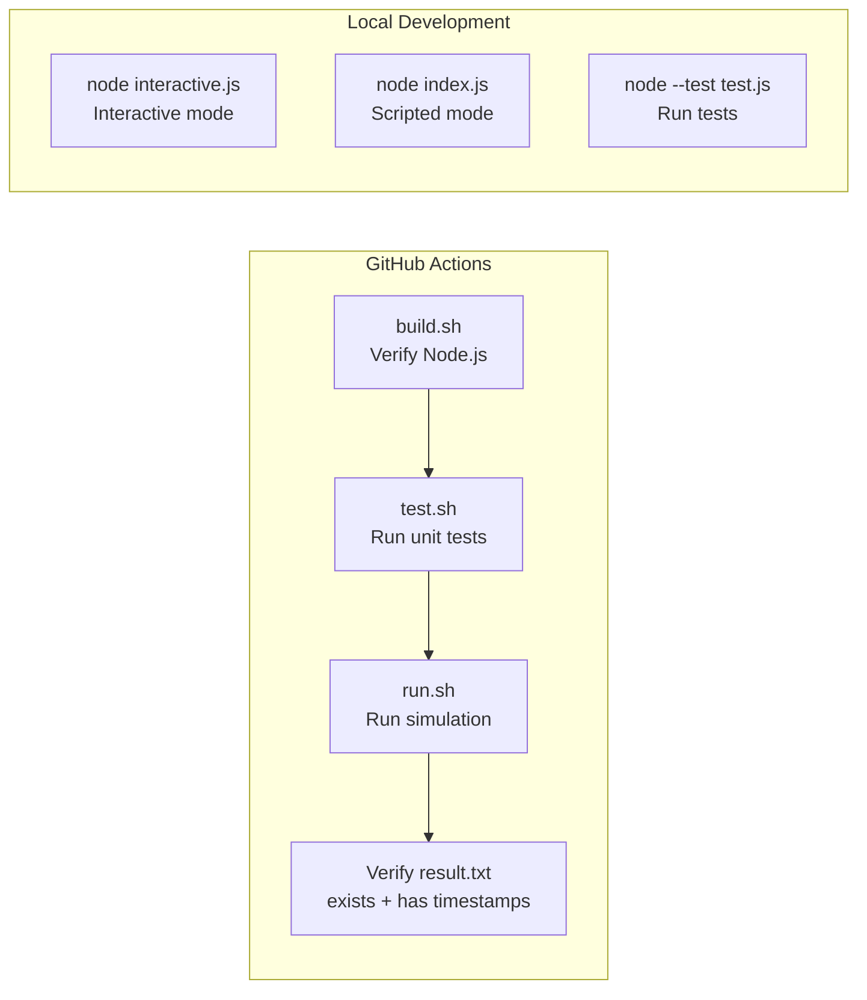

---

## 8. Testing

### Framework

- **Runner:** `node:test` (built-in since Node.js 18)
- **Assertions:** `node:assert` (built-in)
- **No external test dependencies**

### Test Structure

```js
const { describe, it } = require('node:test');
const assert = require('node:assert');

describe('OrderQueue', () => {
  it('should insert VIP before Normal', () => {
    // ...
    assert.strictEqual(queue.dequeue().type, 'VIP');
  });
});
```

### Test Coverage Map

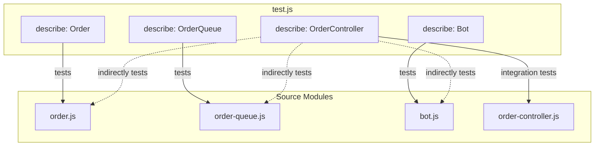

### Test Cases by Module

#### Order Tests

| Test | Verifies |
|------|----------|
| Creation with defaults | `status === 'PENDING'`, `createdAt` set |
| Type assignment | `type === 'NORMAL'` or `'VIP'` |
| toString format | `"Normal Order #1"` / `"⭐ VIP Order #2"` |

#### OrderQueue Tests

| Test | Verifies |
|------|----------|
| Normal orders FIFO | Dequeue returns in insertion order |
| VIP before Normal | VIP inserted after last VIP, before first Normal |
| Multiple VIPs ordering | Second VIP goes after first VIP, not before |
| Dequeue from empty | Returns `null` or `undefined` |
| Re-enqueue VIP | VIP returned from bot goes before all Normal |
| Re-enqueue Normal | Normal returned from bot goes to end |
| Snapshot format | Returns `"⭐#2 → #1 → #3"` |

#### Bot Tests

| Test | Verifies |
|------|----------|
| Creation defaults | `status === 'IDLE'`, `currentOrder === null` |
| Start processing | Status changes to `'PROCESSING'`, order assigned |
| Stop processing | Timer cleared, order returned, status → `'IDLE'` |
| Injectable timer | `processingTime: 50` completes in ~50ms |
| Completion callback | `onComplete` fires after timer |

#### OrderController Tests (Integration)

| Test | Verifies |
|------|----------|
| Add normal order | Order in pending queue, correct position |
| Add VIP order | VIP before Normal in queue |
| Add bot → processes | IDLE bot picks up first pending order |
| Remove newest bot | Last-added bot is removed |
| Remove bot mid-processing | Order returns to queue at correct position |
| Bot goes IDLE | Bot IDLE when queue empty after completion |
| Full end-to-end | Multiple orders + bots, VIP priority respected throughout |

### Running Tests

```bash
# Run all tests
node --test test.js

# Run with verbose output
node --test --test-reporter spec test.js

# Via npm
npm test

# Via shell script
./scripts/test.sh
```

### Injectable Processing Time

The key testability design — processing time is a constructor parameter:

```
Production:  new OrderController()           → 10000ms (default)
Tests:       new OrderController(50)         → 50ms (fast)
```

Tests run the real `setTimeout` path at 50ms instead of bypassing it. This validates the actual async flow — timer setup, callback execution, order state transitions — all in under a second.

---

## 9. CI/CD Pipeline

### GitHub Actions Workflow

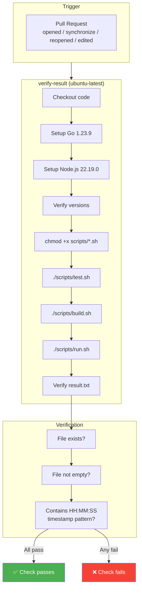

### CI Verification Regex

The workflow checks `scripts/result.txt` with:

```bash
grep -E '[0-9]{2}:[0-9]{2}:[0-9]{2}' scripts/result.txt
```

Our timestamp format `YYYY-MM-DD HH:MM:SS` matches this pattern (the `HH:MM:SS` portion).

### Submission Workflow

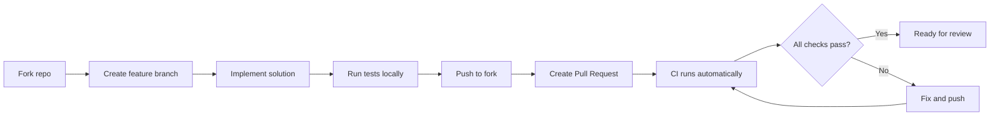

---

## 10. Design Decisions

### Why These Choices?

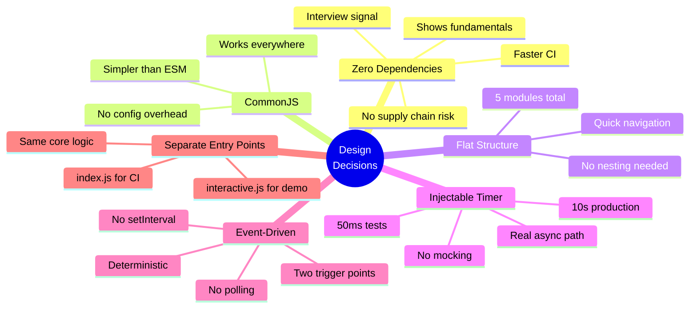

### Trade-off Analysis

| Decision | Pro | Con | Why We Chose It |
|----------|-----|-----|----------------|
| Zero deps | Fast CI, no risk | Reinvent some utilities | Project is small enough, utilities are trivial |
| CommonJS | No config needed | Not "modern" ES modules | ESM adds complexity with no benefit here |
| Flat layout | Quick to navigate | Doesn't scale | This project will never grow beyond ~10 files |
| `node:test` | Built-in, standard | Less feature-rich than Jest | We need `describe/it/assert` — that's enough |
| Injectable timer | Real async testing | Slightly more complex constructor | Eliminates all timer mocking complexity |
| Two entry points | Clean separation | Some shared code | Logger module handles all shared formatting |

---

## 11. Related Documentation

| Document | Path | Purpose |
|----------|------|---------|
| Requirements | [`docs/REQUIREMENTS.md`](./REQUIREMENTS.md) | All 7 requirements with Mermaid diagrams and examples |
| CLI Design | [`docs/CLI-DESIGN.md`](./CLI-DESIGN.md) | Exact visual specification for all CLI screens |
| Proposal | [`docs/PROPOSAL.md`](./PROPOSAL.md) | Implementation strategy and decisions |
| Assignment | [`README.md`](../README.md) | Original assignment instructions |
| CI Workflow | [`.github/workflows/backend-verify-result.yaml`](../.github/workflows/backend-verify-result.yaml) | GitHub Actions pipeline definition |
