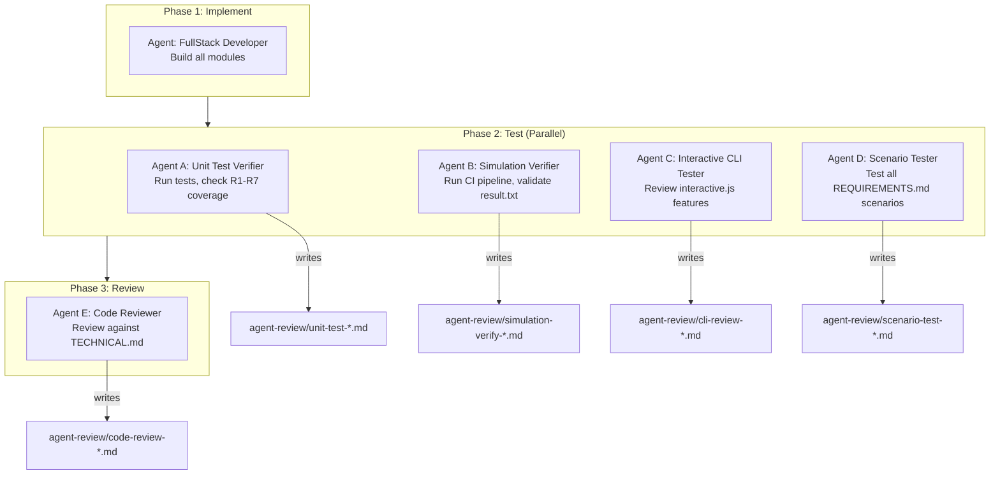

# Agent Dispatch Workflow

This document defines the multi-agent workflow for testing and reviewing the McDonald's Order Management System. Each agent writes its findings to `agent-review/` as proof of work.

---

## Workflow Overview



---

## Phase 1: Implement

**When to run:** Initial build or major refactor.

**Agent:** FullStack Developer (or general-purpose)

**Input docs:**
- `AGENTS.md` — project rules and structure
- `docs/PROPOSAL.md` — architecture and design decisions
- `docs/REQUIREMENTS.md` — all 7 requirements
- `docs/CLI-DESIGN.md` — CLI visual specification
- `docs/TECHNICAL.md` — module API reference

**Tasks:**
1. Read all 4 design docs
2. Create/update all files in `src/`, entry points, tests
3. Run `node --test tests/test.js` — all must pass
4. Run `node index.js` — simulation must complete
5. Verify `result.txt` contains valid timestamps

**Output:** Working codebase, all tests green.

---

## Phase 2: Test (4 Agents in Parallel)

**When to run:** After implementation or any code change.

### Agent A: Unit Test Verifier

**Log file:** `agent-review/unit-test-YYYY-MM-DD.md`

**Steps:**
1. Read `AGENTS.md` for project context
2. Read `tests/test.js` to understand existing tests
3. Run `node --test tests/test.js`
4. Read `docs/REQUIREMENTS.md`
5. Verify tests cover ALL 7 requirements (R1-R7)
6. If any requirement lacks test coverage, add missing tests
7. Re-run tests, confirm all pass

**Report format:**
```markdown
# Unit Test Verification
Date: YYYY-MM-DD HH:MM:SS

## Test Run Results
- Total: X
- Passed: X
- Failed: X

## Requirement Coverage
| Req | Covered By | Status |
|-----|-----------|--------|
| R1  | test name | PASS   |
...

## Issues Found
- ...

## Verdict: PASS / FAIL
```

---

### Agent B: Simulation & result.txt Verifier

**Log file:** `agent-review/simulation-verify-YYYY-MM-DD.md`

**Steps:**
1. Read `AGENTS.md` for project context
2. Run full CI pipeline: `build.sh` → `test.sh` → `run.sh`
3. Read `scripts/result.txt` and verify:
   - File exists and is not empty
   - Contains `[0-9]{2}:[0-9]{2}:[0-9]{2}` timestamps
   - Has header box, section headers, event logs, summary box
   - Icons: `✓`, `✗`, `↩`, `🤖`, `📋`, `⭐`
   - Queue snapshot proves VIP priority
   - Processing time shows 10s
   - Final summary stats are correct
4. Compare against `docs/CLI-DESIGN.md` section 5

**Report format:**
```markdown
# Simulation & result.txt Verification
Date: YYYY-MM-DD HH:MM:SS

## CI Pipeline
| Step | Status |
|------|--------|
| build.sh | PASS/FAIL |
| test.sh  | PASS/FAIL |
| run.sh   | PASS/FAIL |

## result.txt Checks
| Check | Status |
|-------|--------|
| File exists | PASS/FAIL |
| Has timestamps | PASS/FAIL |
| Header box | PASS/FAIL |
...

## result.txt Content
(full content here)

## Verdict: PASS / FAIL
```

---

### Agent C: Interactive CLI Tester

**Log file:** `agent-review/cli-review-YYYY-MM-DD.md`

**Steps:**
1. Read `AGENTS.md` for project context
2. Read `interactive.js` source code
3. Read `docs/CLI-DESIGN.md` for expected behavior
4. Verify implementation covers all features:
   - Main menu (header, clock, numbered commands)
   - Command [1]: Normal order creation
   - Command [2]: VIP order with queue snapshot
   - Command [3]: Bot creation and auto-pickup
   - Command [4]: Bot removal (idle + processing cases)
   - Command [5]: Status board with tables
   - Command [0]: Clean exit
   - Raw mode input (single keypress)
   - Bot completion events print inline
   - Error handling (invalid input, no bots to remove)

**Report format:**
```markdown
# Interactive CLI Review
Date: YYYY-MM-DD HH:MM:SS

## Feature Checklist
| Feature | Status | Notes |
|---------|--------|-------|
| Main menu | IMPLEMENTED/MISSING | ... |
| Command [1] | IMPLEMENTED/MISSING | ... |
...

## Edge Cases
| Case | Handled |
|------|---------|
| No bots to remove | YES/NO |
...

## Code Quality
- ...

## Verdict: PASS / FAIL
```

---

### Agent D: Scenario Coverage Tester

**Log file:** `agent-review/scenario-test-YYYY-MM-DD.md`

**Steps:**
1. Read `AGENTS.md` for project context
2. Read `docs/REQUIREMENTS.md` completely
3. Run `node --test tests/scenario-test.js`
4. Verify all R1-R7 scenarios pass, including:
   - R2: All 4 VIP insertion examples from REQUIREMENTS.md
   - R6: Multi-removal example (Bot#1 processing, Bot#2 idle, Bot#3 processing)
5. If any scenario is missing, write and add it
6. Re-run and confirm all pass

**Report format:**
```markdown
# Scenario Test Coverage
Date: YYYY-MM-DD HH:MM:SS

## Test Run Results
- Total: X
- Passed: X
- Failed: X

## Requirement Scenarios
| Req | Scenario | Status |
|-----|----------|--------|
| R1  | Normal order FIFO | PASS |
| R2  | VIP Example 1 | PASS |
...

## Bugs Found
- ...

## Verdict: PASS / FAIL
```

---

## Phase 3: Review

**When to run:** After all Phase 2 agents complete.

### Agent E: Code Quality Reviewer

**Log file:** `agent-review/code-review-YYYY-MM-DD.md`

**Steps:**
1. Read `AGENTS.md` for project context
2. Read `docs/TECHNICAL.md` — this is the review checklist
3. Read ALL source files in `src/`, entry points, tests
4. Review against TECHNICAL.md checklist:

**Architecture checks:**
- [ ] 3-layer design (Presentation → Business → Domain)
- [ ] Entry points only depend on `src/order-controller` + `src/logger`
- [ ] Core modules don't depend on presentation layer
- [ ] Event-driven assignment (two trigger points)
- [ ] No polling, no arbitrary delays

**Module API checks:**
- [ ] `order.js` matches spec (constructor, toString, exports)
- [ ] `bot.js` matches spec (injectable timer, start/stop, exports)
- [ ] `order-queue.js` matches spec (enqueue priority, dequeue, snapshot)
- [ ] `order-controller.js` matches spec (all public methods)
- [ ] `logger.js` has all specified functions
- [ ] `timestamp.js` has getTimestamp, getTimeOnly, getDateOnly

**Code quality checks:**
- [ ] CommonJS modules (no ES module syntax)
- [ ] Zero external dependencies
- [ ] No unused variables or dead code
- [ ] Consistent naming
- [ ] Clean separation of concerns
- [ ] No hardcoded magic numbers
- [ ] Proper edge case handling
- [ ] No memory leaks (timers cleaned up)
- [ ] Process exits cleanly

5. Fix any issues found
6. Re-run tests after fixes

**Report format:**
```markdown
# Code Quality Review
Date: YYYY-MM-DD HH:MM:SS

## Architecture
| Check | Status |
|-------|--------|
| 3-layer design | PASS/FAIL |
...

## Module API
| Module | Status | Notes |
|--------|--------|-------|
| order.js | PASS/FAIL | ... |
...

## Code Quality
| Check | Status |
|-------|--------|
| CommonJS | PASS/FAIL |
...

## Issues Found & Fixed
| Issue | File | Line | Fix |
|-------|------|------|-----|
| ... | ... | ... | ... |

## Quality Score: X/10
## Verdict: PASS / FAIL
```

---

## How to Dispatch

### Using Claude Code Workflow

```javascript
// Phase 1 → Phase 2 (parallel) → Phase 3
// See the workflow script in the conversation history
// or create a new one referencing this document
```

### Using Individual Agents

```
// Unit test agent
Agent({
  prompt: "Read AGENTS.md at the repository root first. Then run unit tests and verify R1-R7 coverage. Write your log to agent-review/unit-test-YYYY-MM-DD.md",
  label: "unit-test-verification"
})
```

### Manual Verification

```bash
# Quick full check
./scripts/build.sh && ./scripts/test.sh && ./scripts/run.sh

# Detailed test run
node --test tests/test.js
node --test tests/scenario-test.js

# Check result.txt
grep -E '[0-9]{2}:[0-9]{2}:[0-9]{2}' scripts/result.txt && echo "PASS"
```
